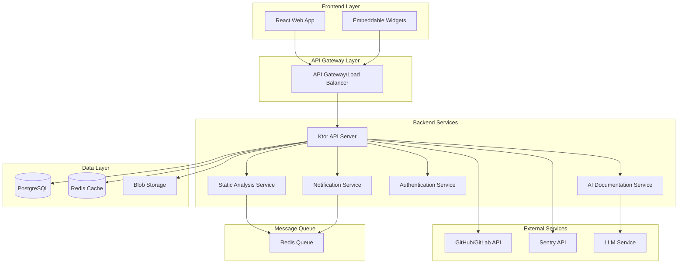

# Design Document

## Overview

The Codebase Health Explorer is designed as a modern, cloud-native application with a microservices-oriented architecture. The system consists of a Kotlin/Ktor backend API, a React/TypeScript frontend, and supporting services for static analysis, AI documentation generation, and error tracking integration. The architecture emphasizes scalability, real-time updates, and extensibility to support multiple programming languages and integration points.

## Architecture

### High-Level Architecture



### Component Architecture

The system follows a layered architecture pattern with clear separation of concerns:

1. **Presentation Layer**: React frontend and embeddable widgets
2. **API Layer**: Ktor-based REST API with WebSocket support
3. **Business Logic Layer**: Service classes handling core functionality
4. **Data Access Layer**: Repository pattern with Exposed ORM
5. **Infrastructure Layer**: External integrations and system services

## Components and Interfaces

### Backend Components

#### 1. API Server (Ktor)
- **Purpose**: Main application server handling HTTP requests and WebSocket connections
- **Key Classes**:
  - `Application.kt`: Main application configuration
  - `RepositoryController.kt`: Repository management endpoints
  - `AnalysisController.kt`: Analysis triggering and status endpoints
  - `DocumentationController.kt`: AI documentation endpoints
  - `AuthController.kt`: Authentication and user management
  - `WebSocketHandler.kt`: Real-time update handling

#### 2. Static Analysis Service
- **Purpose**: Analyze codebases and extract structural information
- **Key Classes**:
  - `StaticAnalyzer.kt`: Main analysis orchestrator
  - `KotlinAnalyzer.kt`: Kotlin-specific analysis
  - `JavaAnalyzer.kt`: Java-specific analysis
  - `TypeScriptAnalyzer.kt`: TypeScript/JavaScript analysis
  - `GitAnalyzer.kt`: Git history and churn analysis
  - `DependencyMapper.kt`: Dependency relationship extraction

#### 3. AI Documentation Service
- **Purpose**: Generate natural language documentation using LLM
- **Key Classes**:
  - `AIDocumentationService.kt`: Main documentation generator
  - `LLMClient.kt`: LLM API integration
  - `PromptTemplate.kt`: Documentation prompt management
  - `DocumentationCache.kt`: Caching layer for generated docs

#### 4. Repository Ingestion Service
- **Purpose**: Handle repository cloning and file processing
- **Key Classes**:
  - `RepositoryIngestionService.kt`: Main ingestion orchestrator
  - `GitCloneService.kt`: Git repository cloning
  - `ZipProcessingService.kt`: ZIP file extraction and processing
  - `FileSystemService.kt`: File system operations

#### 5. Error Integration Service
- **Purpose**: Integrate with external error tracking services
- **Key Classes**:
  - `SentryAdapter.kt`: Sentry API integration
  - `ErrorMappingService.kt`: Map errors to code locations
  - `ErrorAggregationService.kt`: Aggregate and analyze error data

### Frontend Components

#### 1. Core Application
- **Components**:
  - `App.tsx`: Main application component
  - `Layout.tsx`: Application layout and navigation
  - `Router.tsx`: Route configuration

#### 2. Dashboard Components
- **Components**:
  - `DashboardPage.tsx`: Main dashboard view
  - `StatCard.tsx`: Metric display cards
  - `RepositorySelector.tsx`: Repository selection component

#### 3. Visualization Components
- **Components**:
  - `DependencyGraph.tsx`: Interactive dependency visualization
  - `ErrorHeatmap.tsx`: Error frequency visualization
  - `ChurnVisualization.tsx`: Code churn visualization

#### 4. Documentation Components
- **Components**:
  - `DocumentationPanel.tsx`: Documentation display
  - `DocumentationSearch.tsx`: Documentation search interface
  - `CodeViewer.tsx`: Syntax-highlighted code display

#### 5. Repository Management
- **Components**:
  - `RepositoryList.tsx`: Repository listing
  - `AddRepositoryModal.tsx`: Repository addition interface
  - `RepositorySettings.tsx`: Repository configuration

### API Interfaces

#### REST Endpoints

```typescript
// Repository Management
POST   /api/repositories              // Create repository
GET    /api/repositories              // List repositories
GET    /api/repositories/:id          // Get repository details
DELETE /api/repositories/:id          // Delete repository
POST   /api/repositories/:id/analyze  // Trigger analysis

// Analysis Results
GET    /api/repositories/:id/metrics     // Get code metrics
GET    /api/repositories/:id/dependencies // Get dependency graph
GET    /api/repositories/:id/files       // Get file listing
GET    /api/repositories/:id/errors      // Get error data

// Documentation
GET    /api/repositories/:id/docs/:symbol    // Get documentation
POST   /api/repositories/:id/docs/:symbol    // Update documentation
GET    /api/repositories/:id/docs/search     // Search documentation

// Authentication
POST   /api/auth/login           // User login
POST   /api/auth/register        // User registration
POST   /api/auth/oauth/github    // GitHub OAuth
GET    /api/auth/me              // Current user info

// Team Management
GET    /api/teams/:id            // Get team details
POST   /api/teams/:id/invite     // Invite team member
GET    /api/teams/:id/members    // List team members

// Widgets
GET    /api/widgets/dependency-graph/:repoId  // Embeddable dependency graph
GET    /api/widgets/metrics/:repoId           // Embeddable metrics

// Reports
POST   /api/reports/generate     // Generate health report
GET    /api/reports/:id          // Download report
GET    /api/reports              // List reports
```

#### WebSocket Events

```typescript
// Analysis Progress
{
  type: 'analysis_progress',
  repositoryId: string,
  progress: number,
  stage: string,
  message: string
}

// Error Updates
{
  type: 'error_update',
  repositoryId: string,
  errors: ErrorData[],
  timestamp: string
}

// Documentation Updates
{
  type: 'documentation_update',
  repositoryId: string,
  symbolId: string,
  documentation: Documentation
}
```

## Data Models

### Core Entities

```kotlin
// Repository
data class Repository(
    val id: UUID,
    val name: String,
    val url: String?,
    val localPath: String,
    val ownerId: UUID,
    val teamId: UUID?,
    val status: RepositoryStatus,
    val createdAt: Instant,
    val updatedAt: Instant,
    val lastAnalyzedAt: Instant?
)

// Code File
data class CodeFile(
    val id: UUID,
    val repositoryId: UUID,
    val path: String,
    val language: String,
    val size: Long,
    val linesOfCode: Int,
    val complexity: Double,
    val churnScore: Double,
    val errorCount: Int,
    val lastModified: Instant?
)

// Dependency
data class Dependency(
    val id: UUID,
    val repositoryId: UUID,
    val sourceFileId: UUID?,
    val targetFileId: UUID?,
    val sourceSymbol: String,
    val targetSymbol: String,
    val type: DependencyType,
    val strength: Int
)

// Documentation
data class Documentation(
    val id: UUID,
    val repositoryId: UUID,
    val symbolId: String,
    val symbolType: SymbolType,
    val name: String,
    val description: String,
    val usageNotes: String,
    val examples: List<String>,
    val generatedAt: Instant,
    val version: Int
)

// Error Data
data class ErrorData(
    val id: UUID,
    val repositoryId: UUID,
    val fileId: UUID?,
    val message: String,
    val stackTrace: String,
    val count: Int,
    val firstOccurred: Instant,
    val lastOccurred: Instant,
    val severity: ErrorSeverity
)

// User and Team
data class User(
    val id: UUID,
    val email: String,
    val name: String,
    val avatarUrl: String?,
    val createdAt: Instant
)

data class Team(
    val id: UUID,
    val name: String,
    val ownerId: UUID,
    val createdAt: Instant
)

data class TeamMember(
    val teamId: UUID,
    val userId: UUID,
    val role: TeamRole,
    val joinedAt: Instant
)
```

### Database Schema

```sql
-- Users and Teams
CREATE TABLE users (
    id UUID PRIMARY KEY,
    email VARCHAR(255) UNIQUE NOT NULL,
    name VARCHAR(255) NOT NULL,
    password_hash VARCHAR(255),
    avatar_url VARCHAR(500),
    created_at TIMESTAMP NOT NULL DEFAULT NOW()
);

CREATE TABLE teams (
    id UUID PRIMARY KEY,
    name VARCHAR(255) NOT NULL,
    owner_id UUID NOT NULL REFERENCES users(id),
    created_at TIMESTAMP NOT NULL DEFAULT NOW()
);

CREATE TABLE team_members (
    team_id UUID NOT NULL REFERENCES teams(id),
    user_id UUID NOT NULL REFERENCES users(id),
    role VARCHAR(50) NOT NULL,
    joined_at TIMESTAMP NOT NULL DEFAULT NOW(),
    PRIMARY KEY (team_id, user_id)
);

-- Repositories
CREATE TABLE repositories (
    id UUID PRIMARY KEY,
    name VARCHAR(255) NOT NULL,
    url VARCHAR(500),
    local_path VARCHAR(500) NOT NULL,
    owner_id UUID NOT NULL REFERENCES users(id),
    team_id UUID REFERENCES teams(id),
    status VARCHAR(50) NOT NULL,
    created_at TIMESTAMP NOT NULL DEFAULT NOW(),
    updated_at TIMESTAMP NOT NULL DEFAULT NOW(),
    last_analyzed_at TIMESTAMP
);

-- Code Analysis
CREATE TABLE code_files (
    id UUID PRIMARY KEY,
    repository_id UUID NOT NULL REFERENCES repositories(id),
    path VARCHAR(1000) NOT NULL,
    language VARCHAR(50) NOT NULL,
    size BIGINT NOT NULL,
    lines_of_code INTEGER NOT NULL,
    complexity DOUBLE PRECISION NOT NULL,
    churn_score DOUBLE PRECISION NOT NULL DEFAULT 0,
    error_count INTEGER NOT NULL DEFAULT 0,
    last_modified TIMESTAMP
);

CREATE TABLE dependencies (
    id UUID PRIMARY KEY,
    repository_id UUID NOT NULL REFERENCES repositories(id),
    source_file_id UUID REFERENCES code_files(id),
    target_file_id UUID REFERENCES code_files(id),
    source_symbol VARCHAR(500) NOT NULL,
    target_symbol VARCHAR(500) NOT NULL,
    type VARCHAR(50) NOT NULL,
    strength INTEGER NOT NULL DEFAULT 1
);

-- Documentation
CREATE TABLE documentation (
    id UUID PRIMARY KEY,
    repository_id UUID NOT NULL REFERENCES repositories(id),
    symbol_id VARCHAR(500) NOT NULL,
    symbol_type VARCHAR(50) NOT NULL,
    name VARCHAR(500) NOT NULL,
    description TEXT,
    usage_notes TEXT,
    examples JSONB,
    generated_at TIMESTAMP NOT NULL DEFAULT NOW(),
    version INTEGER NOT NULL DEFAULT 1
);

-- Error Tracking
CREATE TABLE error_data (
    id UUID PRIMARY KEY,
    repository_id UUID NOT NULL REFERENCES repositories(id),
    file_id UUID REFERENCES code_files(id),
    message TEXT NOT NULL,
    stack_trace TEXT,
    count INTEGER NOT NULL DEFAULT 1,
    first_occurred TIMESTAMP NOT NULL,
    last_occurred TIMESTAMP NOT NULL,
    severity VARCHAR(50) NOT NULL
);
```

## Error Handling

### Error Categories

1. **Validation Errors**: Invalid input data, malformed requests
2. **Authentication Errors**: Invalid credentials, expired tokens
3. **Authorization Errors**: Insufficient permissions
4. **Resource Errors**: Repository not found, file not accessible
5. **External Service Errors**: GitHub API failures, LLM service unavailable
6. **System Errors**: Database connection issues, out of memory

### Error Response Format

```json
{
  "error": {
    "code": "REPOSITORY_NOT_FOUND",
    "message": "Repository with ID 12345 not found",
    "details": {
      "repositoryId": "12345",
      "timestamp": "2025-01-17T10:30:00Z"
    },
    "requestId": "req_abc123"
  }
}
```

### Error Handling Strategy

1. **Graceful Degradation**: Continue operation when non-critical services fail
2. **Retry Logic**: Automatic retry for transient failures
3. **Circuit Breaker**: Prevent cascade failures from external services
4. **Logging**: Comprehensive error logging for debugging
5. **User Feedback**: Clear error messages for user-facing errors

## Testing Strategy

### Backend Testing

#### Unit Tests
- Service layer logic testing
- Repository pattern testing
- Utility function testing
- Mock external dependencies

#### Integration Tests
- API endpoint testing
- Database integration testing
- External service integration testing
- WebSocket functionality testing

#### Performance Tests
- Load testing for analysis pipeline
- Stress testing for concurrent users
- Memory usage profiling
- Database query optimization

### Frontend Testing

#### Unit Tests
- Component rendering tests
- State management tests
- Utility function tests
- Hook behavior tests

#### Integration Tests
- API integration tests
- User flow tests
- Component interaction tests

#### End-to-End Tests
- Complete user workflows
- Cross-browser compatibility
- Mobile responsiveness
- Widget embedding tests

### Test Data Management

- **Mock Data**: Comprehensive mock datasets for development
- **Test Repositories**: Sample codebases for testing analysis
- **Seed Data**: Database seeding for consistent test environments
- **Test Isolation**: Each test runs with clean state

## Security Considerations

### Authentication and Authorization

1. **JWT Tokens**: Secure token-based authentication
2. **OAuth Integration**: GitHub/GitLab OAuth for repository access
3. **Role-Based Access**: Team-based permission system
4. **Token Refresh**: Automatic token renewal
5. **Session Management**: Secure session handling

### Data Protection

1. **Encryption at Rest**: Database encryption for sensitive data
2. **Encryption in Transit**: HTTPS/TLS for all communications
3. **Input Validation**: Comprehensive input sanitization
4. **SQL Injection Prevention**: Parameterized queries
5. **XSS Protection**: Content Security Policy implementation

### Infrastructure Security

1. **Network Security**: VPC and security groups
2. **Container Security**: Secure Docker images
3. **Secrets Management**: Secure credential storage
4. **Audit Logging**: Comprehensive security event logging
5. **Vulnerability Scanning**: Regular security assessments

## Performance Optimization

### Backend Optimization

1. **Database Indexing**: Optimized database queries
2. **Caching Strategy**: Redis caching for frequently accessed data
3. **Async Processing**: Background job processing for heavy operations
4. **Connection Pooling**: Efficient database connection management
5. **Resource Management**: Memory and CPU optimization

### Frontend Optimization

1. **Code Splitting**: Lazy loading of components
2. **Bundle Optimization**: Minimized JavaScript bundles
3. **Image Optimization**: Compressed and optimized images
4. **Caching Strategy**: Browser caching for static assets
5. **Virtual Scrolling**: Efficient rendering of large datasets

### Scalability Design

1. **Horizontal Scaling**: Stateless service design
2. **Load Balancing**: Distributed request handling
3. **Database Sharding**: Scalable data storage
4. **CDN Integration**: Global content delivery
5. **Auto-scaling**: Dynamic resource allocation